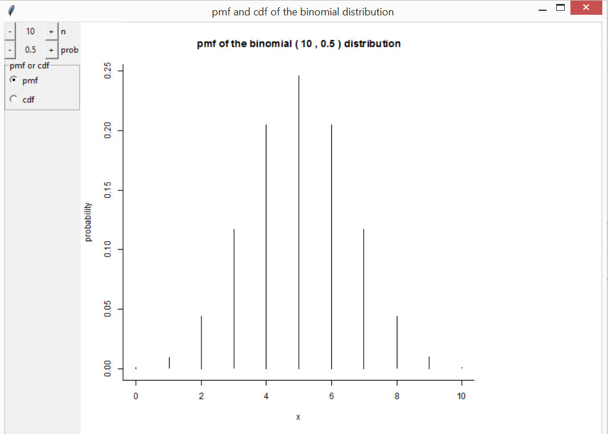
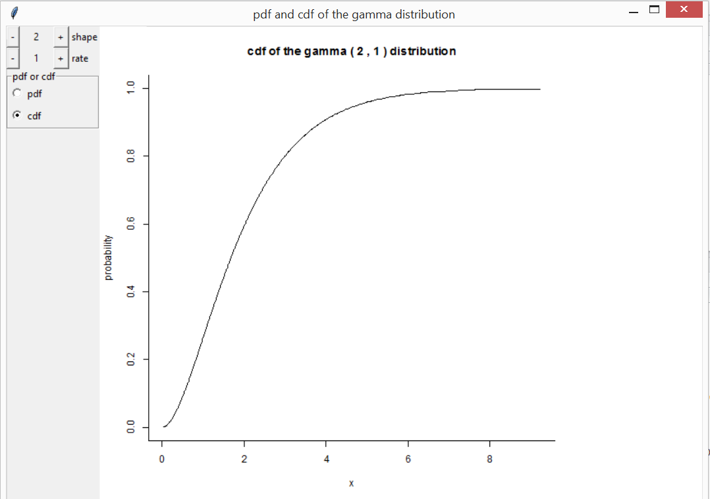
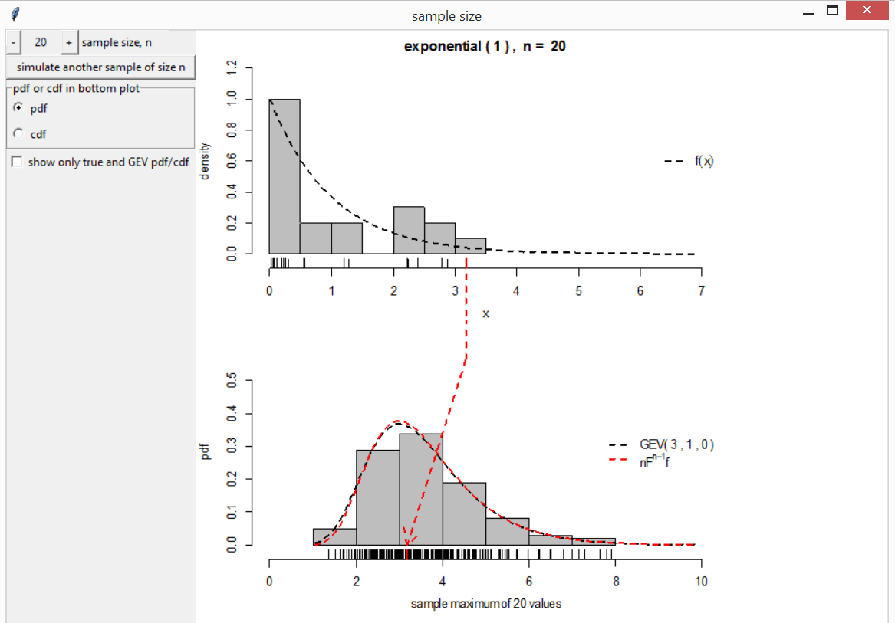
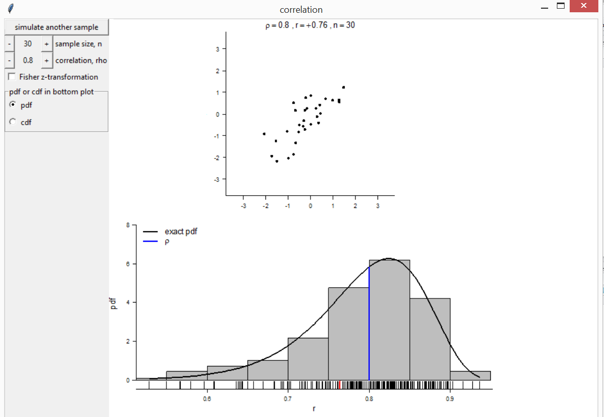
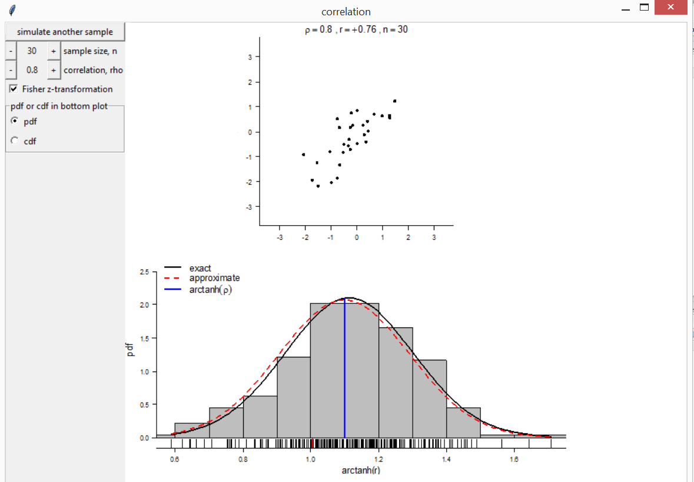
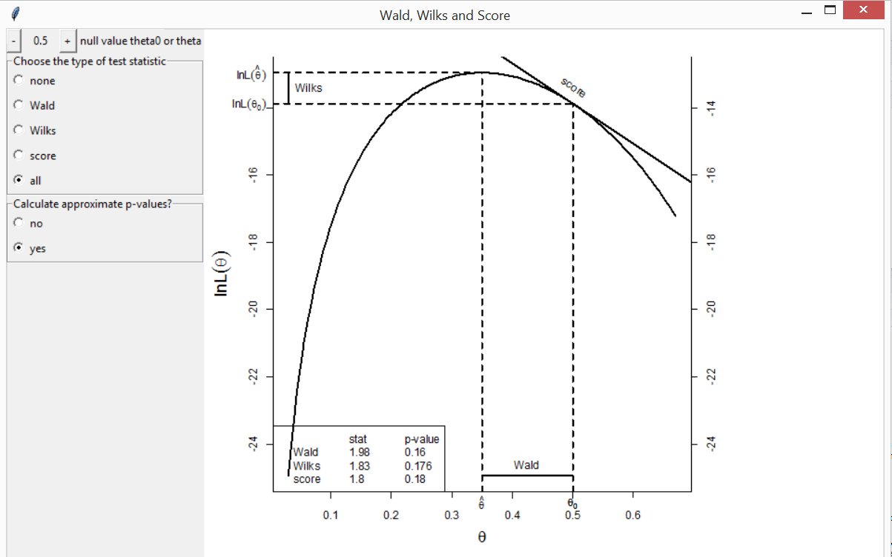
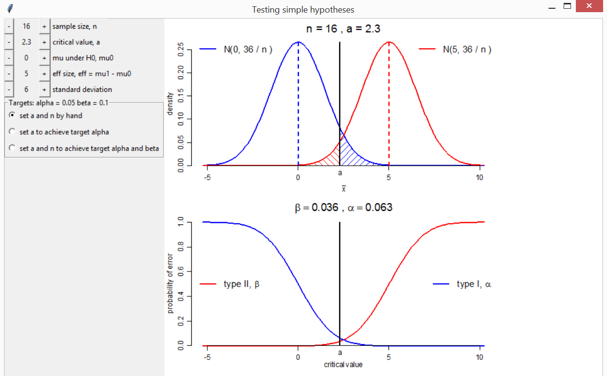
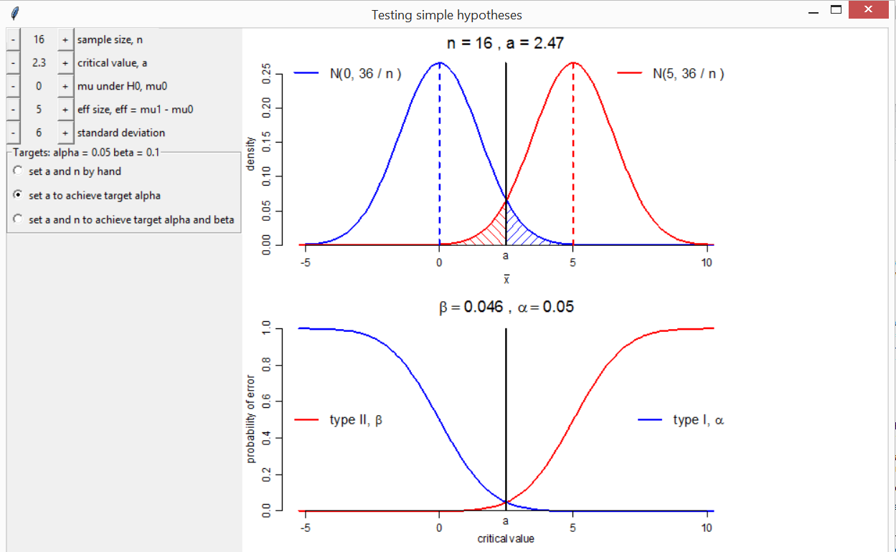
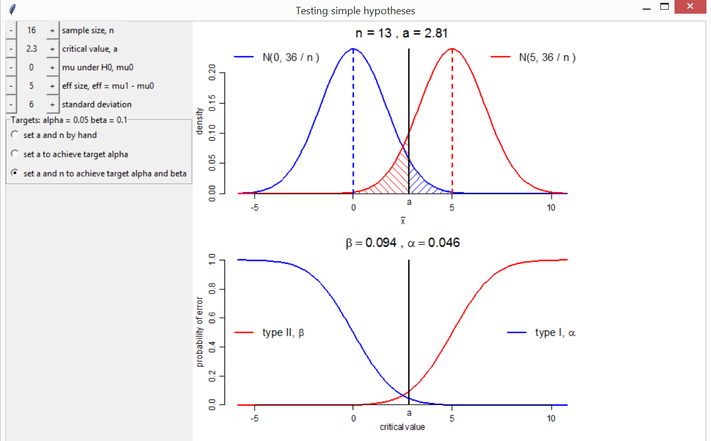

```{r, include = FALSE}
knitr::opts_chunk$set(comment = "#>", collapse = TRUE)
```

The *smovie* package provides movies to help students to understand statistical concepts.  The [rpanel](https://cran.r-project.org/package=rpanel) package [@rpanel] is used to create interactive plots that move in response to changes in parameter values.  There are buttons that can be held down in order to animate the plots.  
This vignette provides an overview of the movies that are available currently, using screenshots from the movies.  Any comments or suggestions are gratefully received.

The function `movies` creates a panel from which examples of the movies can be launched.  It is based on the function `rp.cartoons` in the *rpanel* package, and the image that appears in this panel has been taken from there.  These examples have been set up with sensible default arguments.  

For greater control of an individual example call the relevant function 
directly.  These functions have an argument `panel_plot` that controls whether
the movie appears in inside the panel (`TRUE`) or in the standard graphics 
window (`FALSE`).  The default is `TRUE`, partly because my experience is that 
holding down buttons to animate the plots works better in this case.

```{r}
library(smovie)
```
```{r, eval = FALSE}
movies()
```

## Probability distributions

The functions `discrete` and `continuous` create interactive plots to illustrate how the behaviour of some common probability distributions depends on their parameter values.  There are buttons to change the parameter values and to switch between displaying the p.m.f./p.d.f. and the c.d.f.  These functions also allow you to provide their own distribution.  If you are calling `discrete` or `continuous` directly it may be useful to use the argument `var_support` (for `discrete`) or `var_range` (for `continuous`) to fix the scale on the horizontal axis in order better to see the effects of changing the parameter values.  Otherwise, for some of the distributions, the scale on the horizontal axis will react to changes in the parameters and mask the effects of any changes in location and scale parameters.

### Discrete distributions

```{r, eval = FALSE}
discrete(distn = "binomial")
```

```{r, echo = FALSE, fig.align = 'center', out.width = "600px"}

```

### Continuous distributions

```{r, eval = FALSE}
continuous(distn = "gamma")
```

```{r, echo = FALSE, fig.align = 'center', out.width = "600px"}

```

## Sampling distributions

Three movies illustrate the general idea of the sampling distribution of a statistic.

### Central Limit Theorem (CLT)


### Extremal Types Theorem (ETT)

The [Extremal Types Theorem](https://en.wikipedia.org/wiki/Extreme_value_theory#Univariate_theory) is rather like the CLT but applied to the sample maximum instead of the sample mean.  Loosely speaking, it states that, in many situations, the maximum of a **large number** $n$ of independent random variables has **approximately** a Generalized Extreme Value (GEV) distribution with shape parameter $\xi$.  See @Coles2001 for an introductory account of extreme value theory.

The function `ett` can be used to illustrate the convergence of the distribution of sample maxima to a GEV limit.  Several continous distributions for the underlying variables are available corresponding to different values of the limiting shape parameter $\xi$.  There are buttons to change the value of $n$ and to simulate another sample of size $n$.  As the simulations progress a histogram of the sample maxima can be compared to the GEV approximation to the sampling distribution.  The exact sampling distribution is also displayed.

```{r, eval = FALSE}
ett(distn = "exponential")
```

```{r, echo = FALSE, fig.align = 'center', out.width = "600px"}

```

### Pearson Correlation Coefficient

The function `correlation` illustrates the sampling distribution of the Pearson product moment correlation coefficient, under sampling from a bivariate normal distribution. There are buttons to change the values of $n$ and the true correlation $\rho$ and to simulate another sample of size $n$.  A histogram of the sample correlation coefficients is compared to the exact pdf of the sampling distribution.  There is also an option to switch to a display of [Fisher's $z$-transformation](https://en.wikipedia.org/wiki/Fisher_transformation) $[\ln(1+\rho) - \ln(1-\rho)] / 2$.  Then the histogram can be compared both to the exact distribution and to a normal approximation to this distribution.

```{r, eval = FALSE}
correlation(rho = 0.8, n = 30)
```

```{r, echo = FALSE, fig.align = 'center', out.width = "600px"}

```

```{r, echo = FALSE, fig.align = 'center', out.width = "600px"}

```

## Regression

## Hypothesis Testing

Two movies illustrate key concepts in hypothesis testing.  `wws` compares three test statistics (Wald, Wilks and Score) based on the log-likelihood.  See @Azzalini1996 for details.  `shypo` illustrates the concepts of type I and type II errors, using as an example a test of simple hypothesis about the mean, against the general alternative, based on a random sample from a normal distribtution with known variance. 

### Wald, Wilks and Score test statistics

The function `wws` shows the differing ways in which these three test statistics measure the distance between the maximum likelihood estimate of a scalar parameter $\theta$ and the value $\theta_0$ under a null hypothesis.  There are buttons to change the value of $\theta_0$, select which test statistic to display and to add the values of the test statistics and the associated $p$-values of the test of the null hypothesis that $\theta = \theta_0$.  The example below is based on a sample from a binomial($20, \theta$) distribution in 7 successes and 13 failures are observed.  An example based on a normal distribution is also avaiable.  You may also specify your own log-likelihood.

```{r, eval = FALSE}
wws(theta0 = 0.5, model = "binom", data = c(7, 13))
```

```{r, echo = FALSE, fig.align = 'center', out.width = "600px"}

```

### Testing simply hypothesis: normally distributed variables

Consider a random sample $X_1, \ldots, X_n$ from a normal 
distribution with unknown mean $\mu$ and known variance $\sigma^2$. 
We test the null hypothesis $H_0: \mu = \mu_0$ against the alternative 
$H_1: \mu = \mu_1$, where $\mu_1 > \mu_0$.  Let 
$\bar{X} = (1/n) \sum_{i=1}^n X_i$.  We reject the null hypothesis 
if $\bar{X} > a$.  The type I error $\alpha$ = $P$(reject $H_0$ | $H_0$ true).  The type II error $\beta$ = $P$(don't reject $H_0$ | $H_1$ true).

The function `shypo` creates plots of the normal pdfs under $H_0$ and $H_1$ and of the type I and II errors as a function of the critical value $a$.  Buttons are used to change the values of $n$, $a$, $\mu_0$, $\mu_1 - \mu_0$ (the effect size `eff`) and the population standard deviation $\sigma$, in order to observe the effects on $\alpha$ and $\beta$.  Also included are two radio buttons.  One sets automatically the value of $a$ for which a target type I error equal to \code{target_alpha} is achieved.  The other sets automatically the combination of $a$ and (integer) $n$ for which the target type I error `target_alpha` and type II error `target_beta` are achieved or bettered.

```{r, eval = FALSE}
# 1. Change a (for fixed n) to achieve alpha <= 0.05
# 2. Change a and n to achieve alpha <= 0.05 and beta <= 0.1
shypo(mu0 = 0, eff = 5, n = 16, a = 2.3, delta_a = 0.01)
```

```{r, echo = FALSE, fig.align = 'center', out.width = "600px"}

```
```{r, echo = FALSE, fig.align = 'center', out.width = "600px"}

```
```{r, echo = FALSE, fig.align = 'center', out.width = "600px"}

```

## References

<script type="text/x-mathjax-config">
   MathJax.Hub.Config({  "HTML-CSS": { minScaleAdjust: 125, availableFonts: [] }  });
</script>
